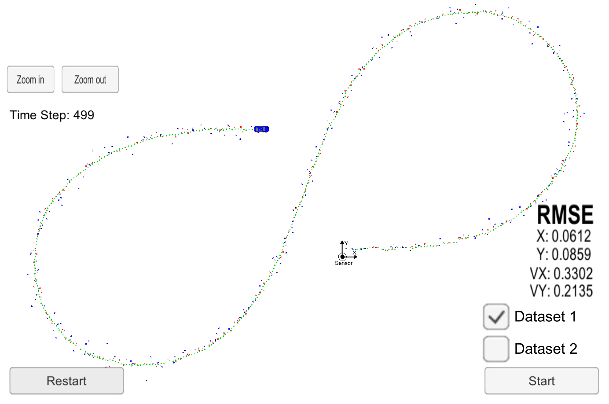

# Unscented Kalman Filter Project
Self-Driving Car Engineer Nanodegree Program

In this project utilize an Unscented Kalman Filter to estimate the state of a moving object of interest with noisy lidar and radar measurements. Passing the project requires obtaining RMSE values that are lower that the tolerance outlined in the project rubric. 

This project involves the Term 2 Simulator which can be downloaded [here](https://github.com/udacity/self-driving-car-sim/releases)

---

## Basic Build Instructions

1. Clone this repo.
2. Make a build directory: `mkdir build && cd build`
3. Compile: `cmake .. && make` 
   * On windows, you may need to run: `cmake .. -G "Unix Makefiles" && make`
4. Run it: `./UnscentedKF `

### Dependencies

* cmake >= 3.5
* make >= 4.1 (Linux, Mac), 3.81 (Windows)
* gcc/g++ >= 5.4

## Implementation

I have used the provided code template and reused the functions implemented in the lessons, but there was still remaining task of tuning the process noise parameters.

Since the object in simulator represent bicycle, I started with following assumptions

* cyclist do not usually brake harder than from 20 km/h in 5 s --> longitudinal acceleration will usually be under 1 m/s^2
* on the bike, you don't often turn more then 45° in 1 s --> yaw acceleration will usually be under 0.75 rad/s^2

Running the code with these parameters and calculating Normalized Inoovation Squared (NIS), it became clear that these parameters were on the safe side. Mainly the yaw acceleration uncertainty seemed to have been overestimated. In the next run I lowered the parameter values to std_a = 0.5 m/s^2 and std_yawdd = 0.5 rad/s^2, this proved to improve the distribution of the NIS, but the yaw acceleration uncertainty was still a little bit overestimated, so I decided to lower the yaw acceleration once more to std_yawdd = 0.25 rad/s^2. This helped, but the RMSE on the first dataset increased, so ultimately the previous set of parameters were chosen - std_a = 0.5 m/s^2 and std_yawdd = 0.5 rad/s^2. The following table contains the data from the parameter tuning:

| std_a  [m/s^2] | NIS_a_5 [%] | NIS_a_5-95 [%] | NIS_a_95 [%] | std_yawdd [rad/s^2] | NIS_yawdd_5 [%] | NIS_yawdd_5-95 [%] | NIS_yawdd_95 [%] | RMSE_px [m] | RMSE_py [m] | RMSE_vx [m/s] | RMSE_vy [m/s] |
|:---:|:---:|:---:|:---:|:---:|:---:|:---:|:---:|:------:|:------:|:------:|:------:|
|   1 |   4 |  93 |   2 |0.75 |   7 |  88 |   3 | 0.0650 | 0.0831 | 0.3324 | 0.2145 |
| 0.5 |   2 |  94 |   2 | 0.5 |   6 |  88 |   4 | 0.0612 | 0.0859 | 0.3302 | 0.2135 |
| 0.5 |   3 |  93 |   2 |0.25 |   5 |  90 |   4 | 0.0683 | 0.0863 | 0.3430 | 0.2318 |

## Results

The unscented Kalman Filter is able to track the object in the simulator.

The RMSE satisfies the rubric limits with following score on the first dataset:

- px: 0.0612 < 0.09
- py: 0.0859 < 0.10
- vx: 0.3302 < 0.40
- vy: 0.2135 < 0.30

The screenshot after running the algorithm on dataset 1:

